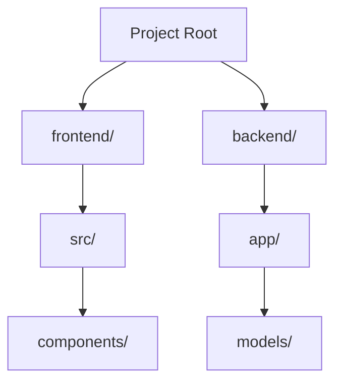
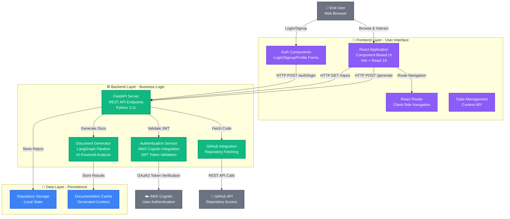

# 🎨 Enhanced Prompts for Meaningful Diagrams

## Overview
Updated the diagram generation system to create **meaningful, detailed architecture diagrams** like GitDiagram - showing what components DO and how they interact, not just folder structures.

---

## 🔥 Key Changes

### Problem
**Before:** Diagrams were just flowcharts of folder structure
```
❌ "frontend/" → "backend/" → "database/"
❌ Generic folder tree visualization
❌ No explanation of component purposes
❌ Missing data flow information
```

### Solution
**After:** Diagrams show functional architecture with detailed explanations
```
✅ "React UI Application<br/>Component-Based Interface" → "FastAPI REST Server<br/>HTTP Request Handler"
✅ Labeled arrows showing data flow: -->|"HTTP POST /api/auth"| 
✅ Component purposes explained in labels
✅ Technologies specified (React, FastAPI, PostgreSQL)
```

---

## 📝 Prompt Enhancements

### 1. **SYSTEM_EXPLANATION_PROMPT** - Focus on Functional Components

**Key Additions:**
```
CRITICAL: Focus on FUNCTIONAL components, not just folder names!

Examples:
❌ BAD: "frontend/src/components" 
✅ GOOD: "UI Component Library" or "Reusable React Components"

❌ BAD: "backend/api"
✅ GOOD: "REST API Endpoints" or "HTTP Request Handlers"

❌ BAD: "database"
✅ GOOD: "PostgreSQL Data Store" or "User Data Repository"
```

**Required Elements:**
- ✅ Main FUNCTIONAL components (Authentication Service, API Gateway, State Management)
- ✅ WHAT each component DOES (purpose and responsibility)
- ✅ HOW components communicate (REST API, WebSockets, Events, Database queries)
- ✅ DATA FLOW paths (User → Frontend → API → Database)
- ✅ Key technologies with their ROLES (React for UI rendering, FastAPI for HTTP server)

---

### 2. **SYSTEM_DIAGRAM_PROMPT** - Detailed Visual Specifications

**Critical Requirements Added:**

#### A. Descriptive Component Names
```
❌ BAD: "Frontend", "Backend", "Utils"
✅ GOOD: "React UI Application", "FastAPI REST Server", "Utility Functions & Helpers"
```

#### B. Specific Data Flow Labels
```
❌ BAD: A --> B
✅ GOOD: UI -->|"HTTP POST /api/users"| API
✅ GOOD: API -->|"SQL Query"| Database
```

#### C. Component Responsibilities in Labels
```mermaid
AuthSvc["Authentication Service<br/>JWT Token Validation"]
UserAPI["User Management API<br/>CRUD Operations"]
```

#### D. Architectural Layer Grouping
```mermaid
subgraph Frontend["🎨 Frontend Layer - User Interface"]
    direction TB
    UI["React Application<br/>Component-Based UI"]
    Router["React Router<br/>Client-Side Navigation"]
end
```

---

## 🎯 Example: Before vs After

### BEFORE (Generic Folder Structure)

**Issues:**
- Just shows folders
- No explanation of what anything does
- No data flow
- No technologies mentioned

---

### AFTER (Meaningful Architecture)


**Improvements:**
✅ Shows what each component does  
✅ Includes technologies (React 19, Vite, FastAPI, Python 3.11)  
✅ Labeled data flow arrows (HTTP POST /auth/login)  
✅ Multi-line descriptions with <br/>  
✅ Icons for visual clarity (👤, 🎨, ⚙️, 💾)  
✅ External actors (User, AWS, GitHub)  
✅ Architectural layers with clear purposes  
✅ Color-coded by type  

---

## 🎨 Visual Enhancements

### Mermaid Configuration Updates
```javascript
// Increased spacing for detailed labels
rankSpacing: 100,      // More vertical space (was 80)
nodeSpacing: 80,       // More horizontal space (was 60)
padding: 25,           // More padding (was 20)
diagramPadding: 30,    // More diagram padding (was 20)
fontSize: '16px',      // Larger font (was 14px)
wrappingWidth: 200     // Allow text wrapping in nodes (NEW)
```

### Better Color Scheme
```javascript
primaryColor: '#8b5cf6',      // Purple for frontend
secondaryColor: '#10b981',    // Green for backend
tertiaryColor: '#f59e0b',     // Orange for data
```

---

## 📋 Diagram Requirements Checklist

Every generated diagram should have:

### Components
- [ ] **Descriptive names** explaining purpose (not just folder names)
- [ ] **Multi-line labels** with technology stack (using `<br/>`)
- [ ] **Icons/emojis** for visual clarity (📱, ⚙️, 💾, 🔗, ☁️)
- [ ] **Responsibilities** clearly stated

### Architecture
- [ ] **Subgraphs** for each architectural layer
- [ ] **Clear layer titles** with descriptions (Frontend - User Interface)
- [ ] **Logical grouping** of related components
- [ ] **External actors** shown (User, External APIs)

### Data Flow
- [ ] **Labeled arrows** showing what is transferred
- [ ] **Specific operations** (HTTP POST /login, SQL Query, OAuth2)
- [ ] **Directional flow** (User → Frontend → Backend → Data)
- [ ] **Communication protocols** mentioned (REST, WebSocket, etc.)

### Visual Design
- [ ] **Color coding** by component type (frontend, backend, data, external)
- [ ] **Proper spacing** for readability
- [ ] **Professional appearance** like GitDiagram reference
- [ ] **Click events** for mapped components (optional but recommended)

---

## 🚀 Testing Instructions

### 1. Restart Backend
```bash
cd backend
python -m uvicorn main:app --reload
```

### 2. Delete & Regenerate
To see the new detailed diagrams:
1. Remove existing repository from your app
2. Re-add with GitHub URL
3. Wait for complete regeneration
4. Check Architecture tab

### 3. Verify Output

**Console should show:**
```
🎨 Using GitDiagram-style 3-phase approach...
📝 Phase 1: Generating architecture explanation...
✅ Phase 1 complete. Explanation length: [large number] chars
🗺️  Phase 2: Mapping components to files...
✅ Phase 2 complete. Mapping length: [number] chars
📊 Phase 3: Generating Mermaid diagram...
✅ Phase 3 complete. Diagram length: [large number] chars
🎉 Diagram generation complete!
```

**Diagram should have:**
- ✅ Detailed component names (not just "Frontend", "Backend")
- ✅ Multi-line labels with <br/>
- ✅ Technologies mentioned (React, FastAPI, PostgreSQL, etc.)
- ✅ Labeled arrows showing data flow (HTTP POST, SQL Query, etc.)
- ✅ Subgraphs with descriptive titles
- ✅ Icons/emojis for visual clarity
- ✅ Color-coded components
- ✅ External actors (User, External APIs)

---

## 🎯 What Makes a Good Diagram Now

### Component Names
```
❌ "API"
✅ "FastAPI REST Server<br/>HTTP Request Handler<br/>Python 3.11"

❌ "Database"
✅ "PostgreSQL<br/>User & Document Data<br/>Relational Storage"

❌ "Auth"
✅ "Authentication Service<br/>JWT Token Management<br/>AWS Cognito Integration"
```

### Arrow Labels
```
❌ Frontend --> Backend
✅ ReactApp -->|"HTTP POST /api/generate"| FastAPI

❌ API --> DB
✅ UserService -->|"SQL: SELECT * FROM users"| PostgreSQL
```

### Subgraph Titles
```
❌ subgraph "Frontend"
✅ subgraph Frontend["🎨 Frontend Layer - User Interface"]

❌ subgraph "Backend"
✅ subgraph Backend["⚙️ Backend Layer - Business Logic & API"]
```

---

## 📊 Expected Quality Improvement

| Metric | Before | After |
|--------|--------|-------|
| **Component Names** | Generic (Frontend, Backend) | Specific (React UI App, FastAPI Server) |
| **Technology Info** | None | Prominent (React 19, Python 3.11) |
| **Data Flow Labels** | Generic arrows | Detailed (HTTP POST /api/auth) |
| **Component Purpose** | Not shown | Clearly stated in labels |
| **Visual Hierarchy** | Flat | Layered with subgraphs |
| **Detail Level** | Low (folder names) | High (responsibilities + tech) |
| **Understandability** | Need to read code | Clear from diagram alone |

---

## 💡 Pro Tips for Best Results

### 1. Comprehensive README
The better your README explains the architecture, the better the diagram will be. Include:
- System architecture overview
- Key components and their roles
- Technologies used and why
- Data flow patterns
- Integration points

### 2. Clear Folder Structure
Organize code logically:
```
frontend/
  src/
    components/    (UI components)
    pages/         (Route pages)
    context/       (State management)
    api/           (API clients)

backend/
  app/
    graph/         (LangGraph pipeline)
    models/        (Data models)
    utils/         (Helper functions)
```

### 3. Descriptive File Names
Use clear, purpose-driven names:
- ✅ `cognito_auth.py` (clear: AWS Cognito authentication)
- ❌ `auth.py` (vague: which auth system?)

---

## 🎉 Summary

Your diagrams will now show:

✅ **Functional components** with clear responsibilities  
✅ **Technologies** prominently labeled  
✅ **Data flow** with specific operations  
✅ **Multi-line descriptions** for detail  
✅ **Visual hierarchy** with subgraphs  
✅ **Professional appearance** like GitDiagram  
✅ **Meaningful architecture** instead of folder structure  

The diagrams now **explain the system** to someone who's never seen the code before - just like the GitDiagram reference you showed! 🚀

---

## 📁 Files Modified

- ✅ `backend/app/prompts/diagram_prompts.py` - Enhanced prompts with detailed requirements
- ✅ `frontend/src/pages/RepoDocs.jsx` - Better Mermaid configuration with increased spacing
- ✅ `DETAILED_DIAGRAMS_GUIDE.md` - This comprehensive guide

**Ready to generate meaningful, professional diagrams!** 🎨✨
