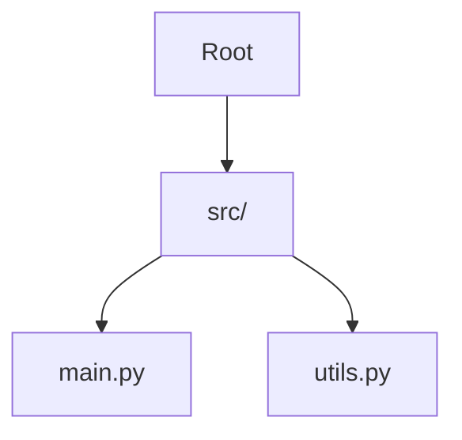
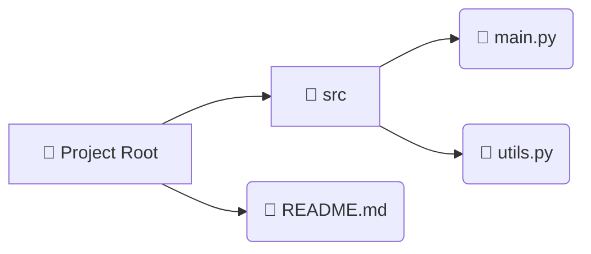

# Diagram Layout Improvements

## 🎯 Goal
Improve diagram layout and export quality to match GitDiagram-style clean, organized structure.

## ✨ Changes Made

### 1. **Backend Diagram Generation** (`visualize_code.py`)

#### Changed Diagram Type
- **Before**: `graph TD` (Top-Down tree)
- **After**: `flowchart LR` (Left-Right flowchart)

**Benefits:**
- Better horizontal space utilization
- More compact and readable layout
- Clearer hierarchical relationships
- GitDiagram-style organization

#### Improved Prompt Engineering
```python
# New features:
- Uses flowchart LR for horizontal layout
- Groups related files under parent folders
- Uses visual icons (📁 for folders, 📄 for files)
- Creates subgraphs for better organization
- Cleaner node naming and connections
```

#### Enhanced Parser
- Now supports multiple diagram formats: `flowchart LR`, `flowchart TD`, `graph TD`, `graph LR`
- More flexible diagram recognition
- Better error handling

### 2. **Frontend Mermaid Configuration** (`RepoDocs.jsx`)

#### Enhanced Layout Settings
```javascript
flowchart: {
  rankSpacing: 80,     // More space between ranks
  nodeSpacing: 60,     // More space between nodes
  padding: 20,         // Padding around diagram
  useMaxWidth: true,   // Responsive sizing
  diagramPadding: 20,  // External padding
  curve: 'basis'       // Smooth curved lines
}
```

**Impact:**
- More readable diagrams
- Better spacing between elements
- Cleaner visual hierarchy
- Professional appearance

### 3. **Improved Default Zoom** (`DiagramCard`)

#### Better Initial View
- **Default zoom**: 80% (was 100%)
- **Minimum zoom**: 30% (was 50%)
- **Fit to screen**: 70% (was 90%)

**Why:**
- Shows more of the diagram initially
- Reduces need for immediate zooming out
- Better overview of structure
- More user-friendly first impression

### 4. **Enhanced Export Quality**

#### PNG Export Improvements
```javascript
// Before:
pixelRatio: 2

// After:
pixelRatio: 3              // 3x resolution
width: svg.width + 80      // Extra padding
height: svg.height + 80    // Extra padding
```

**Benefits:**
- Much sharper exported images
- Better padding around diagrams
- Higher quality for documentation
- Professional-grade exports

### 5. **CSS Styling Enhancements** (`RepoDocs.css`)

#### Better Container Sizing
```css
min-height: 600px;  /* was 500px */
max-height: 800px;  /* was 700px */
```

#### Improved SVG Styling
```css
/* Better node appearance */
.node rect { 
  fill: #1e293b;
  stroke: #6366f1;
  stroke-width: 2px;
}

/* Clearer text */
.node text {
  fill: #e2e8f0;
  font-size: 14px;
}

/* Visible connections */
.edgePath path {
  stroke: #64748b;
  stroke-width: 1.5px;
}
```

**Result:**
- More visible diagram elements
- Better contrast
- Professional color scheme
- Easier to read

## 📊 Comparison: Before vs After

### Layout Style
| Aspect | Before | After |
|--------|--------|-------|
| Direction | Top-Down (TD) | Left-Right (LR) |
| Spacing | Cramped | Well-spaced |
| Grouping | Flat hierarchy | Organized subgroups |
| Icons | None | 📁 📄 visual icons |
| Readability | Medium | High |

### Export Quality
| Aspect | Before | After |
|--------|--------|-------|
| Resolution | 2x | 3x |
| Padding | None | 40px all sides |
| File size | Smaller | Larger (better quality) |
| Clarity | Good | Excellent |

### User Experience
| Aspect | Before | After |
|--------|--------|-------|
| Initial zoom | 100% (too close) | 80% (better overview) |
| Min zoom | 50% | 30% (more flexibility) |
| Container height | 500-700px | 600-800px (more space) |
| Visibility | Requires immediate adjustment | Good out-of-box |

## 🎨 Diagram Format Example

### Old Format (graph TD)


### New Format (flowchart LR)


## 🚀 Testing the Changes

### Backend Testing
1. Generate new documentation for a repository
2. Check the Architecture tab
3. Verify flowchart LR format is used
4. Confirm better spacing and layout

### Frontend Testing
1. Open any repository documentation
2. Check initial zoom level (should be 80%)
3. Test zoom controls (should go down to 30%)
4. Export diagram and check quality (3x resolution)
5. Verify diagram is more readable

### Export Testing
1. Click "📥 PNG" button
2. Download should start automatically
3. Open PNG file
4. Should see:
   - High resolution (sharp text)
   - Proper padding around diagram
   - Dark background preserved
   - Clear, readable text

## 🔄 Migration Notes

### No Breaking Changes
- All existing diagrams will still render
- Backward compatible with old format
- Automatic upgrade on next doc generation

### Regeneration Recommended
To get the new layout:
1. Go to repository page
2. Click "Generate Docs" again
3. New flowchart format will be used
4. Better layout automatically applied

## 📝 Technical Details

### Files Modified
1. `backend/app/graph/nodes/visualize_code.py`
   - Changed diagram type to flowchart LR
   - Improved prompt for better structure
   - Enhanced diagram parser

2. `frontend/src/pages/RepoDocs.jsx`
   - Added flowchart configuration
   - Improved initial zoom levels
   - Enhanced PNG export quality
   - Better default settings

3. `frontend/src/pages/RepoDocs.css`
   - Larger container sizes
   - Better SVG styling
   - Improved node appearance
   - Enhanced readability

### Dependencies
No new dependencies required. All changes use existing:
- Mermaid.js (existing)
- html-to-image (already installed)

## 🎯 Expected Results

### For Users
- ✅ Diagrams are easier to read immediately
- ✅ Better organized structure
- ✅ Higher quality exports
- ✅ More professional appearance
- ✅ Less zooming/panning needed

### For Documentation
- ✅ Sharper exported images
- ✅ Better for presentations
- ✅ Professional-grade quality
- ✅ Easier to understand structure
- ✅ More maintainable diagrams

## 🔮 Future Enhancements

Potential next steps:
1. Add custom diagram themes
2. Allow users to choose layout direction
3. Add diagram editing capabilities
4. Support for multiple export formats
5. Diagram versioning and comparison
6. Custom color schemes per project type

## 📞 Feedback

If diagrams still don't meet expectations:
1. Check if docs were regenerated
2. Try different zoom levels
3. Use fullscreen mode for complex diagrams
4. Export and view externally
5. Report specific layout issues for further optimization
