# 🎯 Diagram Quality Quick Reference

## What Changed

### Component Naming
```
BEFORE ❌                          AFTER ✅
"Frontend"                     →   "React UI Application<br/>Component-Based Interface"
"Backend"                      →   "FastAPI REST Server<br/>HTTP Request Handler"
"Database"                     →   "PostgreSQL<br/>User & Document Storage"
"Auth"                         →   "Authentication Service<br/>JWT Token Management"
```

### Data Flow Labels
```
BEFORE ❌                          AFTER ✅
Frontend --> Backend           →   ReactApp -->|"HTTP POST /api/auth"| FastAPI
API --> Database              →   UserService -->|"SQL: INSERT INTO users"| PostgreSQL
UI --> State                  →   Components -->|"Context API Updates"| StateManager
```

### Subgraph Organization
```
BEFORE ❌                          AFTER ✅
subgraph "Frontend"            →   subgraph Frontend["🎨 Frontend Layer - User Interface"]
subgraph "Backend"             →   subgraph Backend["⚙️ Backend Layer - Business Logic"]
subgraph "Data"                →   subgraph Data["💾 Data Layer - Persistence"]
```

---

## What Your Diagrams Should Look Like

### ✅ GOOD Example (Like GitDiagram)

```mermaid
flowchart TD
    User["👤 End User"]:::external
    
    subgraph Frontend["🎨 Frontend - User Interface"]
        UI["React Application<br/>Vite + React 19<br/>Component-Based UI"]:::frontend
        Auth["Auth Components<br/>Login/Signup Forms"]:::frontend
    end
    
    subgraph Backend["⚙️ Backend - Business Logic"]
        API["FastAPI Server<br/>REST API Endpoints<br/>Python 3.11"]:::backend
        AuthSvc["Authentication Service<br/>AWS Cognito Integration"]:::backend
    end
    
    User -->|"Browse"| UI
    Auth -->|"HTTP POST /auth/login"| API
    API -->|"Validate JWT"| AuthSvc
    
    classDef frontend fill:#8b5cf6,stroke:#7c3aed,color:#fff
    classDef backend fill:#10b981,stroke:#059669,color:#fff
    classDef external fill:#6b7280,stroke:#4b5563,color:#fff
```


**Why it's good:**
✅ Shows component purposes  
✅ Includes technologies  
✅ Labeled arrows  
✅ Multi-line descriptions  
✅ Icons & colors  

---

### ❌ BAD Example (Avoid This)


**Why it's bad:**
❌ Just folder names  
❌ No purpose explained  
❌ No technologies  
❌ No data flow  
❌ Not informative  

---

## Checklist for Every Diagram

### Component Labels
- [ ] Descriptive name (not folder name)
- [ ] Technology mentioned (React, FastAPI, etc.)
- [ ] Purpose explained (what it does)
- [ ] Multi-line with `<br/>` for detail
- [ ] Icon/emoji for visual clarity

### Data Flow
- [ ] Arrows labeled with operation (HTTP POST, SQL Query)
- [ ] Shows what is transferred (JSON data, Events)
- [ ] Direction clear (User → Frontend → Backend)
- [ ] Protocols mentioned (REST API, WebSocket)

### Visual Design
- [ ] Subgraphs for architectural layers
- [ ] Layer titles descriptive (Frontend - User Interface)
- [ ] Color-coded by type
- [ ] External actors shown (User, APIs)
- [ ] Professional spacing

---

## Testing Your Diagram

### Good Signs ✅
```
Console shows:
📝 Phase 1: Generating architecture explanation...
✅ Phase 1 complete. Explanation length: 2000+ chars
🗺️  Phase 2: Mapping components...
✅ Phase 2 complete. Mapping length: 800+ chars
📊 Phase 3: Generating Mermaid diagram...
✅ Phase 3 complete. Diagram length: 1500+ chars
```

### Red Flags ❌
```
- Explanation < 500 chars (too generic)
- Diagram has "frontend/", "backend/" (folder names)
- No <br/> in labels (single-line, not detailed)
- No arrow labels (missing data flow)
- No subgraphs (flat structure)
```

---

## Quick Fix Guide

### Issue: Diagram shows folder structure
**Fix:** Clear repo and regenerate. New prompts force functional naming.

### Issue: No detail in component names
**Fix:** Improve README to explain what each component does.

### Issue: Missing data flow labels
**Fix:** Already fixed in prompts. Regenerate.

### Issue: Colors not showing
**Fix:** Check Mermaid config in frontend. Should have classDef statements.

---

## Example: Your App's Expected Diagram


---

## 🎯 Success Criteria

Your diagram is successful when:
1. **Someone unfamiliar with the codebase** can understand the system from the diagram alone
2. **Technologies are clearly identified** (React 19, FastAPI, AWS Cognito)
3. **Data flow is explicit** (HTTP POST /auth, SQL queries)
4. **Component purposes are obvious** (not just "Frontend" but "React UI Application")
5. **Looks professional** like the GitDiagram reference

---

**Now go test it! Delete a repo and regenerate to see the new detailed diagrams!** 🚀✨
