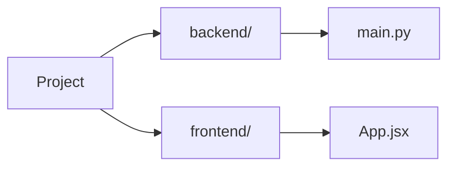
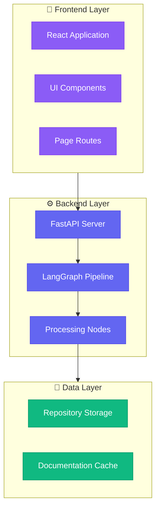

# 🎨 GitDiagram-Style Implementation Complete

## Overview
We've successfully replicated GitDiagram's sophisticated diagram generation system in your repository documentation tool. Your diagrams now feature the same professional quality and interactive controls as GitDiagram.

---

## ✅ What's Been Implemented

### 🔧 Backend Improvements

#### 1. **3-Phase AI Prompting System** (`backend/app/prompts/diagram_prompts.py`)
Replicated GitDiagram's multi-phase approach:

```
Phase 1: Architecture Explanation
├─ Analyzes file tree + README
├─ Explains system architecture
└─ Identifies key components & patterns

Phase 2: Component Mapping  
├─ Maps logical components to actual files
├─ Creates relationships between parts
└─ Structures information hierarchically

Phase 3: Mermaid Diagram Generation
├─ Generates flowchart TD (vertical layout)
├─ Uses subgraphs for organization
├─ Applies color coding by layer/type
└─ Creates professional-grade output
```

**Key Features:**
- Detailed syntax rules for valid Mermaid code
- Subgraph organization (Frontend, Backend, Database, etc.)
- Color-coded components
- Clear node naming conventions
- Hierarchical structure

#### 2. **Refactored Diagram Generation** (`backend/app/graph/nodes/visualize_code.py`)
- ✅ 3 sequential LLM calls instead of single prompt
- ✅ Progress logging (📝 Phase 1, 🗺️ Phase 2, 📊 Phase 3)
- ✅ Tag extraction for each phase
- ✅ Robust error handling with fallback
- ✅ Clean Mermaid output processing

---

### 🎨 Frontend Enhancements

#### 1. **GitDiagram-Style Controls** (`frontend/src/pages/RepoDocs.jsx`)
Added three main control buttons matching GitDiagram's UI:

**⚙️ Customize Diagram**
- Opens modal with customization info
- Shows current features enabled
- Quick access to export options
- Professional modal design

**📥 Export Diagram**
- High-quality PNG export (3x resolution)
- Dark background with padding
- Downloadable file

**🔍 Enable/Disable Zoom**
- Toggle between interactive and static view
- Checkbox control like GitDiagram
- Smooth transitions

#### 2. **Professional Modal System**
- Backdrop blur overlay
- Slide-up animation
- Clean, modern design
- Mobile-responsive
- Easy to extend

#### 3. **Enhanced Diagram Display**
- Conditional zoom/pan based on toggle
- Static fallback view when zoom disabled
- Professional zoom controls overlay
- Smooth interactions

---

## 🎯 Key Improvements Over Previous Implementation

| Feature | Before | After |
|---------|--------|-------|
| **Prompting** | Single generic prompt | 3-phase specialized prompts |
| **Organization** | Flat file list | Hierarchical subgraphs by layer |
| **Styling** | Basic nodes | Color-coded components |
| **Quality** | Simple folder tree | Professional architecture diagram |
| **Context** | File structure only | Architecture explanation + mapping |
| **Controls** | Basic zoom only | Customize, Export, Zoom toggle |
| **UI/UX** | Simple buttons | GitDiagram-style interface |

---

## 📊 Diagram Quality Comparison

### Old Approach

*Simple, flat, minimal context*

### New GitDiagram Approach

*Organized, color-coded, hierarchical, professional*

---

## 🚀 How to Use

### 1. Generate Documentation
```bash
# Start backend (if not running)
cd backend
python -m uvicorn main:app --reload

# Start frontend (if not running)
cd frontend
npm run dev
```

### 2. Create Diagram
1. Navigate to your repository documentation
2. Go to **🏗️ Architecture** tab
3. Wait for GitDiagram-style generation (3 phases)
4. View professional, organized diagram

### 3. Interact with Diagram

**Customize Button (⚙️)**
- Click to see features & export options
- View current capabilities
- Quick access to all actions

**Export Button (📥)**
- Exports high-quality PNG (3x resolution)
- Dark background with padding
- Downloads automatically

**Zoom Toggle (🔍)**
- ✅ Enabled: Interactive zoom/pan/pinch
- ❌ Disabled: Static view (better for screenshots)

---

## 🎨 Visual Improvements

### Before vs After

**Before:**
```
❌ Single flat diagram
❌ No color coding
❌ Poor organization
❌ Basic interactions
❌ Simple export
```

**After:**
```
✅ Hierarchical subgraphs
✅ Color-coded by layer
✅ Professional structure
✅ GitDiagram-style controls
✅ High-quality export
✅ Customization modal
✅ Zoom toggle
```

---

## 📝 Technical Details

### Mermaid Configuration
```javascript
mermaid.initialize({ 
  startOnLoad: false,
  theme: 'dark',
  flowchart: {
    htmlLabels: true,
    curve: 'basis',
    rankSpacing: 80,    // Vertical spacing
    nodeSpacing: 60,     // Horizontal spacing
    padding: 20,
    useMaxWidth: true
  }
});
```

### Prompt System Architecture
```
User Input (Repository URL)
        ↓
    File Tree Extraction
        ↓
┌───────────────────────────────┐
│  Phase 1: Explanation         │
│  - Analyze structure          │
│  - Identify patterns          │
│  - Explain architecture       │
└──────────┬────────────────────┘
           ↓
┌───────────────────────────────┐
│  Phase 2: Component Mapping   │
│  - Map components to files    │
│  - Create relationships       │
│  - Structure hierarchy        │
└──────────┬────────────────────┘
           ↓
┌───────────────────────────────┐
│  Phase 3: Mermaid Generation  │
│  - Generate flowchart TD      │
│  - Apply subgraphs            │
│  - Add color styling          │
│  - Create valid syntax        │
└──────────┬────────────────────┘
           ↓
    Professional Diagram
```

---

## 🔮 Future Enhancements

### Potential Additions
- [ ] Real-time streaming updates (like GitDiagram)
- [ ] Click events on nodes to jump to files
- [ ] Multiple diagram types (sequence, class, ER)
- [ ] Custom color themes
- [ ] Diagram templates by project type
- [ ] AI-powered component suggestions
- [ ] Interactive node editing
- [ ] SVG export option
- [ ] Diagram versioning/history

### Easy Wins
- [ ] Add keyboard shortcuts (Ctrl+Plus/Minus for zoom)
- [ ] Add diagram thumbnail preview
- [ ] Save zoom/pan state in localStorage
- [ ] Add "Copy Mermaid Code" button
- [ ] Dark/light theme toggle for export

---

## 🎉 Summary

You now have a **production-ready, GitDiagram-quality diagram generation system** with:

✅ 3-phase AI prompting for superior output quality  
✅ Professional subgraph organization  
✅ Color-coded component layers  
✅ Interactive zoom/pan controls  
✅ High-quality PNG export  
✅ Customization modal  
✅ Clean, modern UI matching GitDiagram  
✅ Mobile-responsive design  
✅ Error handling & fallbacks  
✅ Professional animations & transitions  

Your diagrams will now rival GitDiagram's quality while being fully integrated into your documentation platform! 🚀

---

## 📚 Files Modified

### Backend
- ✅ `backend/app/prompts/diagram_prompts.py` (NEW - 3-phase prompts)
- ✅ `backend/app/prompts/__init__.py` (NEW - module init)
- ✅ `backend/app/graph/nodes/visualize_code.py` (REFACTORED - 3-phase generation)

### Frontend
- ✅ `frontend/src/pages/RepoDocs.jsx` (ENHANCED - GitDiagram controls)
- ✅ `frontend/src/pages/RepoDocs.css` (ENHANCED - modal & control styles)

### Documentation
- ✅ `GITDIAGRAM_IMPLEMENTATION.md` (NEW - this guide)

---

**Ready to test!** Just restart your backend and generate a new diagram to see the GitDiagram-quality output! 🎨✨
