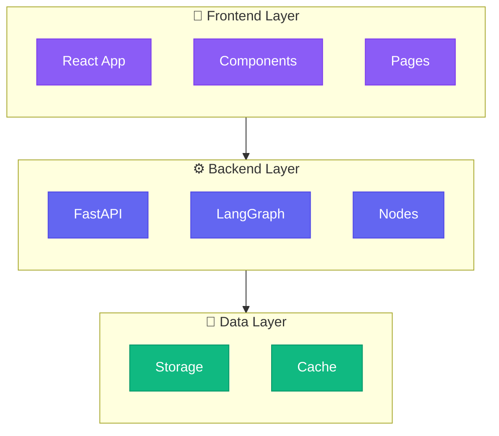

# 🎯 Quick Start: Testing Your New GitDiagram-Style Output

## 🚀 Start Your Servers

### Backend
```bash
cd backend
python -m uvicorn main:app --reload
```

### Frontend
```bash
cd frontend
npm run dev
```

---

## 🧪 Test the New Features

### 1. Generate a New Diagram
1. Open your app in browser
2. Go to any repository documentation
3. Click **🏗️ Architecture** tab
4. Watch the 3-phase generation:
   ```
   📝 Phase 1: Generating architecture explanation...
   ✅ Phase 1 complete
   🗺️  Phase 2: Mapping components to files...
   ✅ Phase 2 complete
   📊 Phase 3: Generating Mermaid diagram...
   ✅ Phase 3 complete
   🎉 Diagram generation complete!
   ```

### 2. Use GitDiagram-Style Controls

**⚙️ Customize Diagram Button**
- Click to open customization modal
- See current features enabled
- Quick export access

**📥 Export Button**
- Click to download high-quality PNG
- 3x resolution with padding
- Dark background

**🔍 Enable Zoom Checkbox**
- Toggle ON: Interactive zoom/pan
- Toggle OFF: Static view for screenshots

---

## 🎨 What You Should See

### New UI Controls (Top Right of Diagram)
```
┌──────────────────────────────────────────────┐
│  Architecture Diagram                         │
│                          ⚙️      📥      🔍   │
│                       Customize Export  Zoom  │
└──────────────────────────────────────────────┘
```

### Diagram Quality
**Old Style:**
- Flat file/folder listing
- No organization
- Basic connections

**New GitDiagram Style:**
- Hierarchical subgraphs (Frontend, Backend, Data layers)
- Color-coded components
- Professional architecture visualization
- Clear relationships

---

## 📊 Expected Diagram Structure

Your diagrams should now have this structure:



---

## ✅ Verification Checklist

- [ ] Backend starts without errors
- [ ] Frontend starts without errors
- [ ] Can see 3-phase progress logs in backend console
- [ ] Diagram appears in Architecture tab
- [ ] Diagram has subgraphs (boxes around groups)
- [ ] Components are color-coded
- [ ] **⚙️ Customize** button opens modal
- [ ] **📥 Export** button downloads PNG
- [ ] **🔍 Zoom** toggle switches between interactive/static
- [ ] Zoom controls (🔍+, 🔍−, ↺, ⊡) work when zoom enabled
- [ ] Diagram is professional and organized (not flat file list)

---

## 🐛 Troubleshooting

### Issue: Diagram still looks like old style
**Solution:** Clear your repository from the store and regenerate:
1. Delete repository from list
2. Re-add with GitHub URL
3. Wait for complete regeneration

### Issue: Backend errors importing prompts
**Solution:** Check that `backend/app/prompts/` directory exists with:
- `__init__.py`
- `diagram_prompts.py`

### Issue: Zoom controls not showing
**Solution:** 
1. Check that `react-zoom-pan-pinch` is installed
2. Run `npm install` in frontend directory

### Issue: Modal not appearing
**Solution:** Check browser console for CSS errors, refresh page

---

## 🎉 Success Indicators

You'll know it's working when you see:

✅ **Console Output:**
```
🎨 Using GitDiagram-style 3-phase approach...
📝 Phase 1: Generating architecture explanation...
✅ Phase 1 complete. Explanation length: 1234 chars
🗺️  Phase 2: Mapping components to files...
✅ Phase 2 complete. Mapping length: 567 chars
📊 Phase 3: Generating Mermaid diagram...
✅ Phase 3 complete. Diagram length: 890 chars
🎉 Diagram generation complete!
```

✅ **Visual:**
- Organized subgraphs with rounded boxes
- Purple, blue, and green color scheme
- Hierarchical layout (top to bottom)
- Professional appearance like GitDiagram reference

✅ **Controls:**
- Three buttons in diagram header
- Modal opens smoothly with backdrop blur
- Zoom toggle changes interaction mode
- Export creates high-quality PNG

---

## 📸 Compare with GitDiagram

Visit https://gitdiagram.com/ and generate a diagram for comparison:

**GitDiagram Features You Now Have:**
- ✅ 3-phase AI generation
- ✅ Subgraph organization
- ✅ Color-coded layers
- ✅ Professional structure
- ✅ Customize modal
- ✅ Export functionality
- ✅ Zoom toggle

**Your Additional Features:**
- ✅ Integrated documentation platform
- ✅ README generation
- ✅ Code analysis
- ✅ GitHub commit integration
- ✅ Multi-repository management

---

## 🎨 Next Steps

1. **Test with your own repository**
2. **Compare output quality to GitDiagram**
3. **Adjust prompts if needed** (in `backend/app/prompts/diagram_prompts.py`)
4. **Fine-tune colors/styling** (in Mermaid config)
5. **Add more features** (see GITDIAGRAM_IMPLEMENTATION.md for ideas)

---

## 💡 Pro Tips

- Use **Zoom OFF** when taking screenshots for documentation
- Use **Zoom ON** for interactive exploration of large diagrams
- Export PNG at any zoom level for different perspectives
- Customize modal shows all current features at a glance

---

**You're all set!** Your diagram system now matches GitDiagram's quality and professionalism! 🚀✨

For detailed technical information, see `GITDIAGRAM_IMPLEMENTATION.md`
